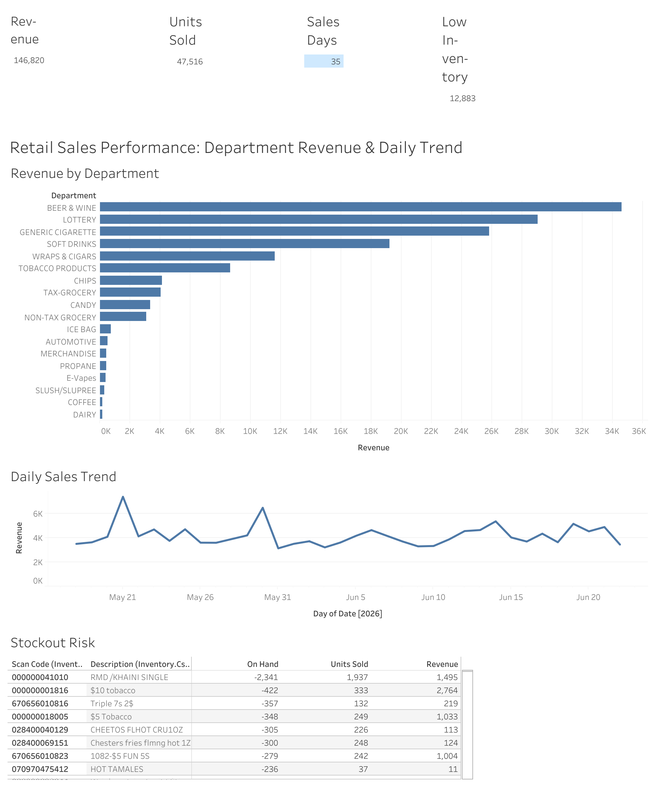

# Retail Sales Analytics + AI Assistant

An end-to-end retail sales and inventory analytics project: SQL analysis, Python data loading, inventory metrics, and a grounded AI assistant over sanitized retail data.

## Live Dashboard

[](https://public.tableau.com/views/RetailSalesAnalytics_17825124731470/RetailSalesPerformanceDepartmentRevenueDailyTrend)

Interactive Tableau Public dashboard (revenue by department + daily sales trend):

**https://public.tableau.com/views/RetailSalesAnalytics_17825124731470/RetailSalesPerformanceDepartmentRevenueDailyTrend**

Built from `data/sales.csv`. `scan_code` is loaded as text so leading zeros are preserved; the uncategorized (blank) department — which Tableau labels `Null` — is excluded from the revenue ranking and flagged as a master-data gap.

## Business Problem

A retail operator needs a lightweight way to review sales performance, inventory exceptions, stockout risk, and item master-data gaps from sanitized point-of-sale and inventory exports.

## Data Used

- `data/sales.csv`: daily item-level sales totals from `2026-05-18` to `2026-06-22`.
- `data/inventory.csv`: one inventory snapshot from `2026-06-23`.

The data is sanitized. Revenue is useful for relative analysis, not audited financial reporting.

## Methods

- Loaded both CSV files into SQLite with `scripts/load_sqlite.py`.
- Treated `scan_code` as text so leading zeros are preserved.
- Used SQL to calculate department revenue, top-selling items, daily trends, low inventory, stockout risk, overstock candidates, over/short exceptions, and sold items missing from inventory.
- Built a grounded assistant that routes natural-language questions to approved SQLite-backed tools and refuses unsupported questions.
- Added evaluation tests for grounded answers and refusal behavior.
- Documented source data, assumptions, AI assistant design, and limitations in `docs/`.

## Key Metrics

- Sales rows loaded: `19,098`
- Inventory rows loaded: `14,444`
- Distinct sales dates: `35`
- Low or negative inventory rows: `12,883` (negative values are operational exceptions to investigate, not data errors — see `docs/data_dictionary.md`)
- Stockout-risk items: `1,298`
- Overstock / slow-moving candidates: `70`
- Sold scan codes missing from inventory: `32`

## Sample Findings

- Highest revenue departments: `BEER & WINE`, `LOTTERY`, and `GENERIC CIGARETTE`.
- Highest revenue day in the sales file: `2026-05-21`, with `7,400.72` sanitized revenue and `2,533` units sold.
- The stockout-risk query surfaces items with low or negative `on_hand` that also have matching sales activity.
- The missing-inventory query found sold scan codes that do not appear in the inventory snapshot, which suggests item-master or inventory-file gaps.

## Limitations

- No customer, receipt, basket, or loyalty data.
- No cost, margin, or profit fields.
- Inventory is a single snapshot, not a full inventory history.
- Revenue is sanitized/scaled.
- Daily sales data cannot explain causes like promotions, staffing, holidays, or weather.

## How To Run

```bash
python3 scripts/load_sqlite.py
sqlite3 data/retail.db < sql/analysis_queries.sql
```

Ask the assistant:

```bash
python3 scripts/assistant.py "Which departments have the most revenue?"
python3 scripts/assistant.py "What items are stockout risks?"

# Refused on purpose: there is no cost/margin data, so the assistant
# declines instead of guessing.
python3 scripts/assistant.py "What products have the highest profit margin?"
```

Run evaluation tests:

```bash
python3 tests/evaluate_assistant.py
```

Useful docs:

- `docs/data_dictionary.md`
- `docs/ai_assistant.md`
- `reports/retail_summary.md`

## Skills Demonstrated

- Python data loading with standard library CSV and SQLite tooling.
- SQL aggregation, joins, exception queries, and business metric design.
- Data documentation, assumptions, and limitation handling.
- Dashboard and report design for sales and inventory operations.
- Grounded assistant design using approved SQL-backed tools.
- Evaluation tests for grounded answers and refusal behavior.

## What's Included

- CSV-to-SQLite loader
- SQL analysis queries
- Data dictionary
- Dashboard-style summary report
- Published interactive Tableau Public dashboard
- Grounded AI assistant
- Evaluation tests
